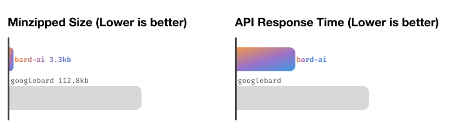

<picture>

  <source media="(prefers-color-scheme: dark)" srcset="./assets/banner@dark.svg">
  <source media="(prefers-color-scheme: light)" srcset="./assets/banner@light.svg">
  
</picture>
<h1 align="center">
    A JavaScript API for Google Bard
</h1>
<p align="center">
  <a aria-label="NPM Version" href="https://www.npmjs.com/package/bard-ai">
    
  </a>
  <a aria-label="NPM Download Count" href="https://www.npmjs.com/package/bard-ai">
    
  </a>
  <a aria-label="bard-ai Size" href="https://www.npmjs.com/package/bard-ai">
    
  </a>
  <a aria-label="Join the community on Slack" href="https://join.slack.com/t/bard-aiworkspace/shared_invite/zt-1y1g3570m-Hx_N3IShMYBMkR6jpRyRjw">
    
  </a>
</p>
<p align="center">
  Ready to start? <a href="https://bard-ai-docs.vercel.app">Read the Docs</a>
</p>

## Library Overview

-   🤖 [Invoke Google Bard directly with `askAI`](https://bard-ai-docs.vercel.app/basics/askAI)
-   🔄 [Create instances of Bard with `Bard.Chat`](https://bard-ai-docs.vercel.app/basics/chat)
-   📤 [Import and Export conversations with `Bard.Chat.export`](https://bard-ai-docs.vercel.app/advanced/importExportChat)
-   🧑‍💻 [Get all the metadata you need with the `useJSON` flag](https://bard-ai-docs.vercel.app/advanced/useJSON)

## Features

-   🌳 **Tree-shakeable**: [Maximize efficiency](https://bundlephobia.com/package/bard-ai@1.2.2)
-   🪶 **Tiny**: Just [1.3kb minzipped](#size)
-   🚀 **Fast**: Up to [150% faster than `googlebard`](#speed)
-   📚 **Typesafe**: [Types included](https://bard-ai-docs.vercel.app/typescript) out-of-the-box
-   😍 **Straightforward API**: [Learn in minutes](https://bard-ai-docs.vercel.app/)
-   💲 **Free Forever**: [Authenticate](https://bard-ai-docs.vercel.app/prerequisites/authentication) and use without cost.
-   💨 **No dependencies**: Uses [native `fetch`](https://bard-ai-docs.vercel.app/fetch)

## Introduction

`bard-ai` was built to provide free AI to everyone, through Google Bard.
It's completely free, and takes minimal setup.

Originally based off of acheong08's [Python Bard API Code](https://github.com/acheong08/Bard).

## Comparison

Compared to leading JS Bard API [`googlebard`](https://github.com/PawanOsman/GoogleBard):

<picture>

  <source media="(prefers-color-scheme: dark)" srcset="./assets/compare@dark.svg">
  <source media="(prefers-color-scheme: light)" srcset="./assets/compare@light.svg">
  
</picture>

<details>
<summary>Learn more...</summary>
<br/>

Currently, the most popular JavaScript Bard is [GoogleBard by PawanOsman](https://github.com/PawanOsman/GoogleBard).
However, there are 3 main reasons why `bard-ai` is superior:

#### Size

After being minified and gzipped, `bard-ai` is 1.3KB, while `google-bard` is 112.8KB (checked with [Bundlephobia](https://bundlephobia.com/)). That makes `bard-ai` ~99% smaller!

#### Speed

This library is up to 150% faster, as tested with `hyperfine --warmup 1 --runs 3` between `bard-ai` and `googlebard`[^1].

#### API

`googlebard` overcomplicates many things, including importing the cookies to importing and exporting conversations. `bard-ai` has been built to make it simple and easy to use.

</details>

[^1]:
    Run `hyperfine --warmup 1 --runs 3` between `bard-ai` v1.2.2 and `googlebard` with following code for `googlebard` (in "googlebard.js"):

    ```javascript
    import { Bard } from "googlebard";

    let cookies = `__Secure-1PSID=MY_KEY`;
    let bot = new Bard(cookies);

    let response = await bot.ask("Hello world!");
    console.log(response);
    ```

    And following code for `bard-ai` (in "bard-ai.js"):

    ```javascript
    import Bard, { askAI } from "bard-ai";

    await Bard.init("MY_KEY");

    console.log(await askAI("Hello world!"));
    ```

    With this benchmark output:

    ```
    Benchmark 1: node bard-ai.js
    Time (mean ± σ):      6.951 s ±  2.272 s    [User: 0.181 s, System: 0.044 s]
    Range (min … max):    5.333 s …  9.549 s    3 runs

    Benchmark 2: node googlebard.js
    Time (mean ± σ):      7.691 s ±  1.029 s    [User: 0.389 s, System: 0.073 s]
    Range (min … max):    6.510 s …  8.394 s    3 runs

    Summary
    'node bard-ai.js' ran
    1.11 ± 0.39 times faster than 'node googlebard.js'
    ```

## Let's Get Started!

Read the documentation, available at [bard-ai-docs.vercel.app](https://bard-ai-docs.vercel.app/).

### Table of Contents

-   [Introduction](https://bard-ai-docs.vercel.app/)
-   Pre-Requisites
    -   [Installation](https://bard-ai-docs.vercel.app/prerequisites/installation)
    -   [Authentication](https://bard-ai-docs.vercel.app/prerequisites/authentication)
-   Basics
    -   [Quick Start](https://bard-ai-docs.vercel.app/basics/quickstart)
    -   [Initialization](https://bard-ai-docs.vercel.app/basics/initialization)
    -   [Ask AI](https://bard-ai-docs.vercel.app/basics/askAI)
    -   [Bard Chat](https://bard-ai-docs.vercel.app/basics/chat)
-   Advanced
    -   [Importing/Exporting Chats](https://bard-ai-docs.vercel.app/advanced/importExportChat)
    -   [JSON Response Flag](https://bard-ai-docs.vercel.app/advanced/useJSON)
-   [Typescript Support](https://bard-ai-docs.vercel.app/typescript)
-   [Polyfilling Fetch](https://bard-ai-docs.vercel.app/fetch)

Go ahead! It's easy to learn... Trust me!

<br/>
<br/>
<br/>
